# serverless-lab
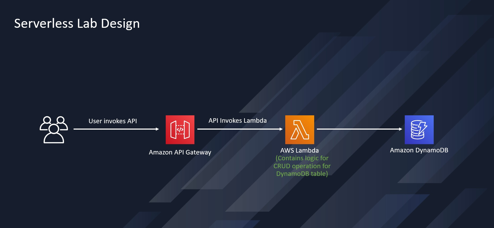
An Amazon API Gateway is a collection of resources and methods. I created one resource (DynamoDBManager) and define one method (POST) on it. The method is backed by a Lambda function (LambdaFunctionOverHttps). That is, when you call the API through an HTTPS endpoint, Amazon API Gateway invokes the Lambda function.

The POST method on the DynamoDBManager resource supports the following DynamoDB operations:

Create, update, delete, read and scan an item.
Other operations (echo, ping), not related to DynamoDB, that you can use for testing are also supported.
The request payload you send in the POST request identifies the DynamoDB operation and provides necessary data. For example:

The following is a sample request payload for a DynamoDB create item operation:
```json
{
    "operation": "create",
    "tableName": "lambda-apigateway",
    "payload": {
        "Item": {
            "id": "1",
            "name": "Bob"
        }
    }
}
```
The following is a sample request payload for a DynamoDB read item operation:
````json
{
    "operation": "read",
    "tableName": "lambda-apigateway",
    "payload": {
        "Key": {
            "id": "1"
        }
    }
}
````
Create a Custom Policy to add to the execution role of the Lambda function. This custom policy has the permissions that the function needs to write data to DynamoDB and upload logs:
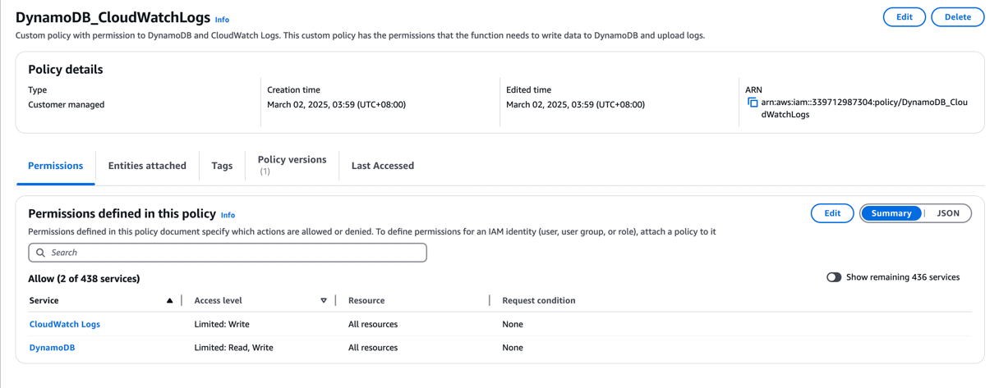
Custom Policy:
````json
{
"Version": "2012-10-17",
"Statement": [
{
  "Sid": "Stmt1428341300017",
  "Action": [
    "dynamodb:DeleteItem",
    "dynamodb:GetItem",
    "dynamodb:PutItem",
    "dynamodb:Query",
    "dynamodb:Scan",
    "dynamodb:UpdateItem"
  ],
  "Effect": "Allow",
  "Resource": "*"
},
{
  "Sid": "",
  "Resource": "*",
  "Action": [
    "logs:CreateLogGroup",
    "logs:CreateLogStream",
    "logs:PutLogEvents"
  ],
  "Effect": "Allow"
}
]
}
````


Create an Execution Role for Lambda and attach the DynamoDB_CloudWatchLogs policy.
This will give the Lambda function permission to access AWS resources.
The role should have the following properties:
   * Trusted entity – Lambda.
   * Role name – lambda-apigateway-role.
   * Permissions – Custom policy(created above) with permission to DynamoDB and CloudWatch Logs. This custom policy has the permissions that the function needs to write data to DynamoDB and upload logs.
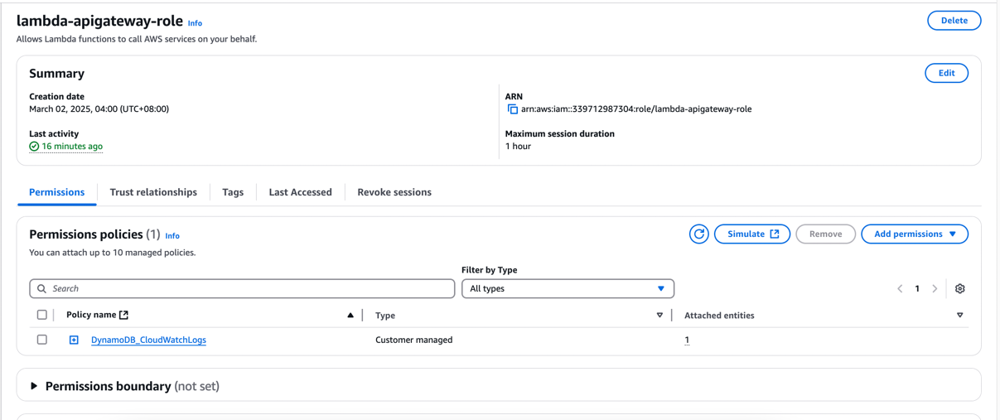

Create Lambda Function with the following code. Since we are using the Lambda function to interact with other AWS services and resources we can use Boto3(AWS SDK for Python) to interface with these resources:


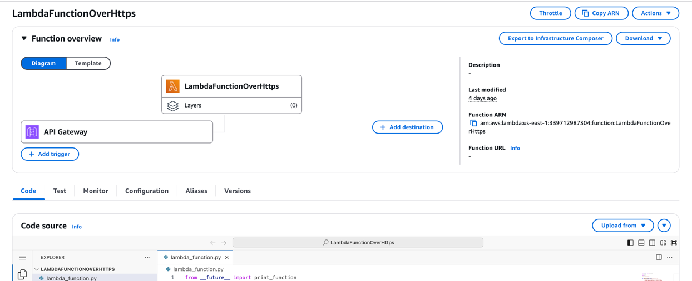

```
from __future__ import print_function

import boto3
import json

print('Loading function')


def lambda_handler(event, context):
'''Provide an event that contains the following keys:

      - operation: one of the operations in the operations dict below
      - tableName: required for operations that interact with DynamoDB
      - payload: a parameter to pass to the operation being performed
    '''
    #print("Received event: " + json.dumps(event, indent=2))

    operation = event['operation']

    if 'tableName' in event:
        dynamo = boto3.resource('dynamodb').Table(event['tableName'])

    operations = {
        'create': lambda x: dynamo.put_item(**x),
        'read': lambda x: dynamo.get_item(**x),
        'update': lambda x: dynamo.update_item(**x),
        'delete': lambda x: dynamo.delete_item(**x),
        'list': lambda x: dynamo.scan(**x),
        'echo': lambda x: x,
        'ping': lambda x: 'pong'
    }

    if operation in operations:
        return operations[operation](event.get('payload'))
    else:
        raise ValueError('Unrecognized operation "{}"'.format(operation))


```
Test Lambda Function
Let's test our newly created function. We haven't created DynamoDB and the API yet, so we'll do a sample echo operation. The function should output whatever input we pass.
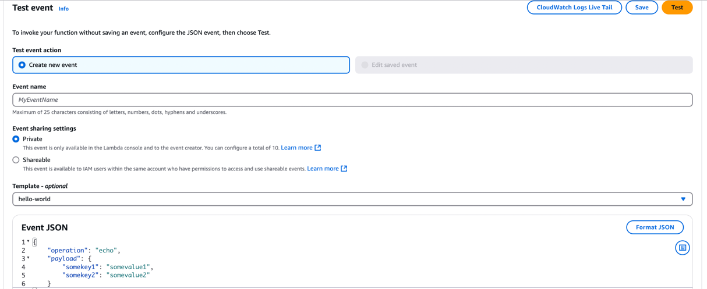


Deploy the code and test it with the following event:
````json
{
    "operation": "echo",
    "payload": {
        "somekey1": "somevalue1",
        "somekey2": "somevalue2"
    }
}
   ````
Click "Test", and it will execute the test event. You should see the output in the console
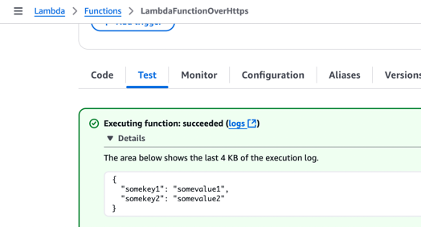

Create a DynamoDB table and an API to invoke the Lambda function:
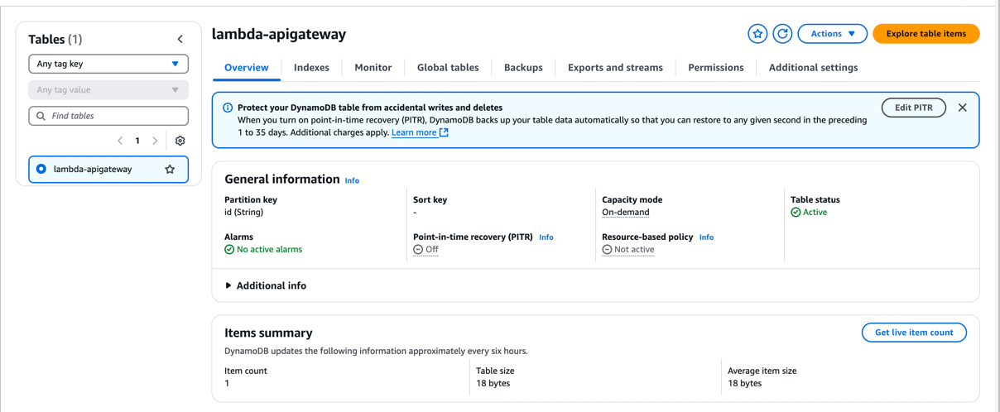

Create an API in API Gateway.Each API is collection of resources and methods that are integrated with backend HTTP endpoints, Lambda functions, or other AWS services. Typically, API resources are organized in a resource tree according to the application logic.

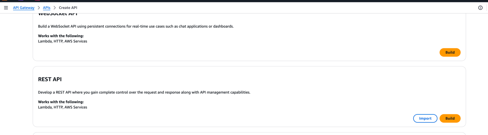
I have added a resource called DynamoDBManager. A post method has been created for the API under Resource.
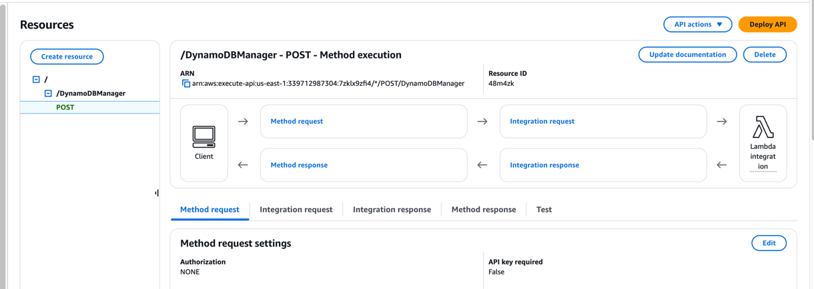

After creating the resource, we need to deploy the API.
The API has been deployed to a stage named Prod:
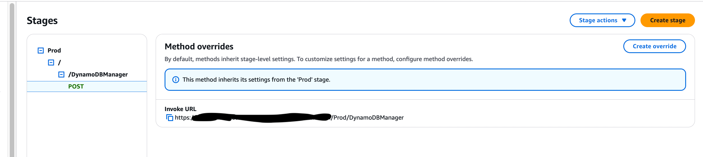
Create an item in DynamoDB table using the following JSON:
````json
{
    "operation": "create",
    "tableName": "lambda-apigateway",
    "payload": {
        "Item": {
            "id": "1234ABCD",
            "number": 5
        }
    }
}
````
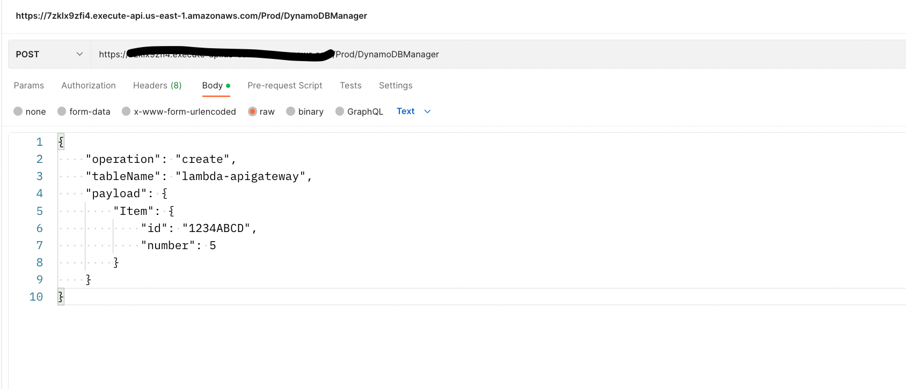


Item is inserted into DynamoDB table:
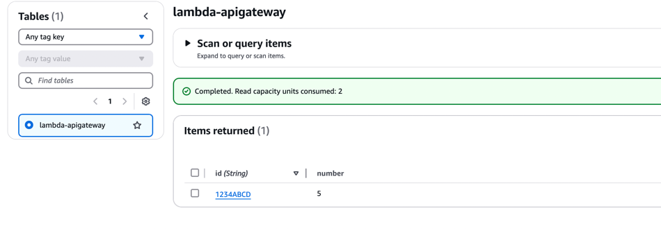

Use list to see all the items inserted into the DynamoDB table
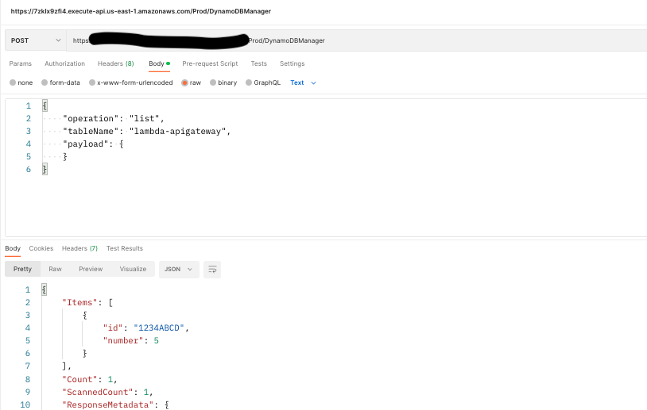

## Scalability
### Lambda function
As the Lambda function receives more requests, it automatically scales up the number of execution environments to handle these requests until your account reaches its concurrency quota.
To protect against over-scaling in response to sudden bursts of traffic, Lambda limits how fast your functions can scale. This concurrency scaling rate is the maximum rate at which functions in your account can scale in response to increased requests. (That is, how quickly Lambda can create new execution environments.)
### DynamoDB
Use auto scaling to handle capacity and lower the cost of workloads that have an unpredictable traffic pattern.
Auto scaling responds quickly and simplifies capacity management, which lowers costs by scaling your table’s provisioned capacity and reducing operational overhead.
### API Gateway
Amazon API Gateway will automatically scale to handle the amount of traffic your API receives.

## Availability
### Lambda function
Lambda runs your function in multiple Availability Zones to ensure that it is available to process events in case of a service interruption in a single zone. If you configure your function to connect to a virtual private cloud (VPC) in your account, specify subnets in multiple Availability Zones to ensure high availability.
### DynamoDB
Use DynamoDB global tables that sync across AWS regions. DynamoDB automatically spreads the data and traffic for your tables over a sufficient number of servers to handle your throughput and storage requirements, while maintaining consistent and fast performance. All of your data is stored on solid-state disks (SSDs) and is automatically replicated across multiple Availability Zones in an AWS Region, providing built-in high availability and data durability.
### API Gateway
As a fully managed Regional service, API Gateway operates in multiple Availability Zones in each Region, using the redundancy of Availability Zones to minimize infrastructure failure as a category of availability risk. API Gateway is designed to automatically recover from the failure of an Availability Zone.
To prevent your APIs from being overwhelmed by too many requests, API Gateway throttles requests to your APIs.
You can use Route 53 health checks to control DNS failover from an API Gateway API in a primary region to an API Gateway API in a secondary region. 

## Cost Optimization
### Lambda function
Since Lambda is serverless, there are no servers to manage, it scales automatically, and you only pay for what you use. However, choosing the right memory size settings for a Lambda function is still an important task. AWS Compute Optimizer supports Lambda functions and uses machine-learning to provide memory size recommendations for Lambda functions.
This allows you to reduce costs and increase performance for your Lambda-based serverless workloads.
### DynamoDB
* To optimize the cost of a DynamoDB table, you can do the following: 
* Minimize the number of attributes per item - Reduce the number of attributes per item as DynamoDB charges based on the total data size.
* Utilize batch write operations - Use batch write operations to group multiple write requests into a single API call.
* Store infrequently accessed data in cheaper storage like S3 - Move older, less frequently accessed data to cheaper storage like Amazon S3.
* Leverage automatic scaling - Enable automatic scaling to adjust capacity dynamically based on traffic fluctuations.
* Choose a cost-effective AWS region -Choosing a cost-effective AWS region for your DynamoDB table involves considering the cost of storage, data access patterns, and network latency.  
* Consider a single-table design - Consider a single table design to reduce the number of tables and secondary indexes needed.
* Carefully manage your provisioned capacity based on usage patterns - Use provisioned capacity mode to set specific read and write capacity units based on your expected usage. 
### API Gateway
* Choose the right API type (like using HTTP APIs instead of REST APIs when possible) - Generally cheaper than REST APIs, suitable when you don't need all the advanced features of REST.
* Utilizing caching mechanisms to reduce backend calls - Store responses from backend services in API Gateway cache to reduce calls to your backend, lowering costs.
* Monitoring API usage to identify unnecessary requests - Analyze usage data to identify API endpoints that are being called excessively and might be optimized or removed.
* Implementing appropriate throttling and rate limits - Set appropriate limits on the number of API requests a client can make within a specific time frame to manage costs and prevent excessive usage.
* Leveraging AWS Cost Explorer to analyze and manage your spending on API Gateway services - Use AWS Cost Explorer to visualize your API Gateway costs, identify areas for optimization, and track spending over time. 

## Security
### Lambda function
You can protect your Lambda functions by controlling who can access them with identity and access management (IAM) policies.
These policies should define who has access and what they can access. In addition, you can leverage tags for fine-grained access to your Lambda functions, versions, and layers.
### DynamoDB
DynamoDB utilizes IAM to help you securely control access to your DynamoDB resources. With IAM, you can centrally manage permissions that control which DynamoDB users can access resources.
By default, DynamoDB encrypts all customer data at rest. Encryption at rest enhances the security of your data by using encryption keys stored in AWS Key Management Service (AWS KMS).
### API Gateway
API Gateway provides a number of ways to protect your API from certain threats, like malicious users or spikes in traffic. You can protect your API using strategies like generating SSL certificates, configuring a web application firewall, setting throttling targets, and only allowing access to your API from a Virtual Private Cloud (VPC).
* Implement least privilege access - Use IAM policies to implement least privilege access for creating, reading, updating, or deleting API Gateway APIs.
* Implement logging - Use CloudWatch Logs or Amazon Data Firehose to log requests to your APIs.
* Implement Amazon CloudWatch alarms - Using CloudWatch alarms, you watch a single metric over a time period that you specify. If the metric exceeds a given threshold, a notification is sent to an Amazon Simple Notification Service topic or AWS Auto Scaling policy.
* Enable AWS CloudTrail - CloudTrail provides a record of actions taken by a user, role, or an AWS service in API Gateway. 
* Enable AWS Config - AWS Config provides a detailed view of the configuration of AWS resources in your account. You can see how resources are related, get a history of configuration changes, and see how relationships and configurations change over time. You can use AWS Config to define rules that evaluate resource configurations for data compliance.
* Use AWS Security Hub - Monitor your usage of API Gateway as it relates to security best practices by using AWS Security Hub. Security Hub uses security controls to evaluate resource configurations and security standards to help you comply with various compliance frameworks.